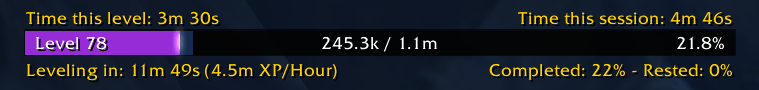

# WrathXPBar

A lightweight and customizable experience bar addon for **World of Warcraft 3.3.5a (Wrath of the Lich King)**.

WrathXPBar provides a clean, modern-style XP bar inspired by WeakAuras layouts, with detailed leveling statistics such as session time, XP per hour, and estimated time to next level.

Designed to be minimal, informative, and lightweight.

---

## Features

- Clean **WeakAuras-style XP bar**
- **Session statistics**
  - Time this level
  - Time this session
  - XP per hour
  - Estimated time to level
- **Rested XP overlay**
- **Smooth XP bar animation**
- **Optional reputation bar at max level**
- **Session XP tracking across level-ups**
- **Movable and configurable UI**
- **Tooltip with detailed leveling information**
- **Lightweight and optimized for 3.3.5a**

---

## Commands

| Command | Description |
|-------|-------------|
| `/wxp move` | Move the bar |
| `/wxp lock` | Lock the bar position |
| `/wxp reset` | Reset bar position |
| `/wxp width 500` | Change bar width |
| `/wxp scale 1.2` | Change UI scale |
| `/wxp alpha 0.8` | Change transparency |
| `/wxp hidecombat` | Hide the bar in combat |
| `/wxp hidemax` | Hide the bar at max level |
| `/wxp rep` | Show reputation bar at max level |
| `/wxp test` | Show preview |

---

## Installation

1. Download the addon.
2. Extract the folder **WrathXPBar**.
3. Place it into: ## World of Warcraft/Interface/AddOns/
4. Restart the game!

---

## Supported Client

- **Wrath of the Lich King 3.3.5a**

---

## Screenshot

